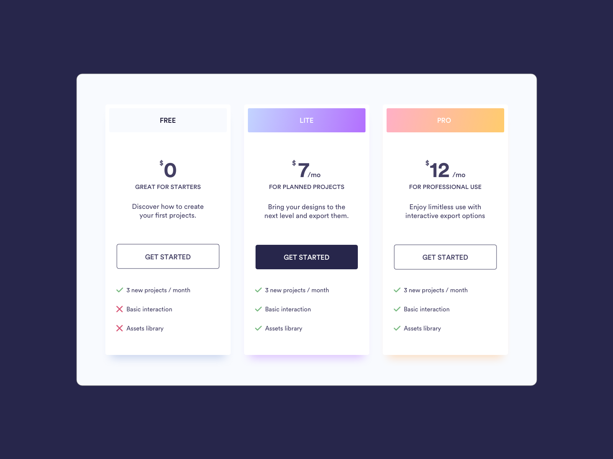

# Price component solution

This is a pricing card template project.  

## Table of contents

- [Overview](#overview)
  - [Description](#description)
  - [Screenshot](#screenshot)
- [My process](#my-process)
  - [Built with](#built-with)
  - [What I learned](#what-i-learned)
  - [Continued development](#continued-development)
  - [Useful resources](#useful-resources)
- [Author](#author)
- [Acknowledgments](#acknowledgments)

## Overview

### Description

Users should be able to:

- View subscription tier, pricing, price descriptions, and tier descriptions.
- Select tier subscription

### Screenshot

## My process

### Built with

- Semantic HTML5 markup
- CSS custom properties, pseudo elements, and nesting
- Flexbox

## Author

- Website - [Bernard Major](https://www.bernardmajor.com)
